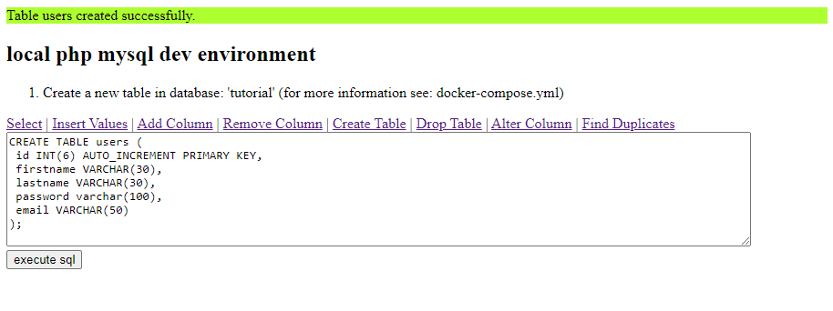

# simple local PHP + MySQL dev environment

## Docker setup
- download Docker
- run Docker desktop app
- run `docker-compose up` to start the nginx server
- open [http://127.0.0.1](http://127.0.0.1) to go to the user management website
- you can connect to the maria db database with dbeaver Server-Host: `localhost` Port: `3306`

## DBeaver Connection
- Treiber: `MariaDB`
- Host: `localhost`
- Port: `3306`
- Datenbank: `tutorial`
- User: `tutorial`
- Passwort: `secret`

## Infos
- ...

## index.php

## Links
- [https://www.sitepoint.com/docker-php-development-environment/](https://www.sitepoint.com/docker-php-development-environment/)
